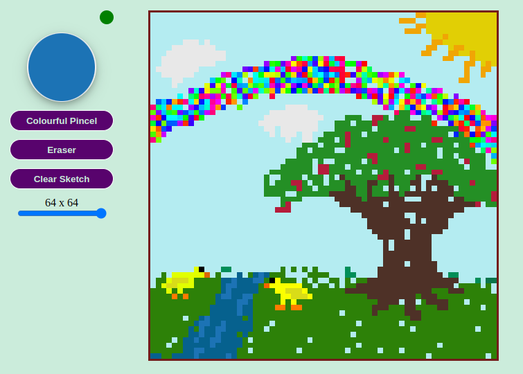

# My Paint Board

Web App created using only JavaScript, HTML and CSS

It Was a fun and interesting proyect, you can paint and create pixel art like portraits

| Live: <a alt="" target="_blank" href="https://lastgentlman.github.io/ETCH-A-SKETCH/">GitHub Page</a> |  |
|-----------------------------------------------------|---------------------------------------------------------------------------------|

